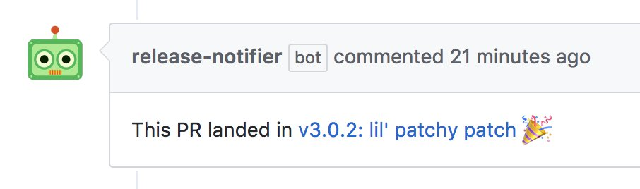

# release-notifier-bot

A [Probot](https://github.com/probot/probot) that leaves helpful comments on your pull requests when they land in a release.

This bot is designed for use with projects that are using [GitHub Releases](https://help.github.com/articles/creating-releases/) and [Semantic Versioning](https://semver.org/).

## Install

To get a comment from this bot when a pull request lands in a release for a repo:

1. Go to the [Release Notifier](https://github.com/apps/release-notifier) Github App page.
2. Click the `Configure` button.

From here you will be guided through the installation process for adding the release notifier bot to your repo or github org of choice.

## License

MIT
